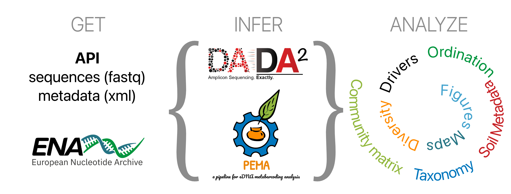

# Island Sampling Day (ISD)

The Island Sampling Day draws inspiration from the Ocean 
Sampling Day that is a consortium that facilitates yearly samplings 
in stations from all around the world. This has great applications 
in monitoring and comprehending the complexity of the ocean microbiome 
and it's drivers.

The Island Sampling Day has been organised in two islands, Moorea 
in the French Polynisia and Crete in Greece. The Moorea sampling day event took 
place in March 2022 (in the context of [GSC22](https://genomicsstandardsconsortium.github.io/GSC22-Moorea/program.html).
In Crete, two sampling events have taken place: the first one in June 2016 
(in the context of [GSC18](https://www.gensc.org/pages/meetings/GSC18/GSC18.html)), 
and the second one in July 2022. For both sampling events more information can be cound [here](https://lab42open-team.github.io/isd-crete-website/).

Most of the content that follows relates to the Crete 2016 Island Sampling Day.

## Soil microbiome sampling

The metagenomic revolution enabled environmental microbial biodiversity 
studies which for the past 20 years, have sampled multiple local and 
large scale regions (e.g. France microbiome, Earth Microbiome). These 
studies indicated that microbes are omnipresent and impact global ecosystem 
processes through their abundance, versatility and biotic interactions 
(i.e., interactomes). Additionally, microbes influence the major nutrient
cycles and ecosystem functions, such as plant and animal productivity. 
Changes in the structure of microbial communities can be indicative of
ecosystem tipping points (e.g., aridification).

## Chapter one: Crete 2016

ISD is a soil microbiome study to explore environmental drivers of community
composition across ecosystems in the island of Crete, Greece.

A snapshot of the prokaryotic diversity across the island of Crete. Aim to:

1. Put metadata into action through a citizen science project to demonstrate their value in future samplings
2. Describe the first full island microbial community assessment
3. Shed light on the difffering phylotypes across Crete’s distinct terrestrial habitats (<i>intra comparison</i>)
4. Present a “local” (island) vs “global” (world, e.g. EMP) soil phylotype comparative analysis (<i>inter comparison</i>)

This repository holds ISD molecular ecology analysis pertinent scripts.
ISD sequence data are available as a <a href="https://www.ebi.ac.uk/ena/data/view/PRJEB21776" target="blank">European Nucleotide Archive repository project</a>. BioSample IDs can be linked to the metadata sample_names through the field "source material identifiers”.

## Contents

* [Methods](#methods)
* [Sampling](#sampling)
* [Scripts](#scripts)
* [Data retrieval](#data-retrieval)
* [Data integration](#data-integration)
* [Inference and Taxonomy](#inference-and-taxonomy)
* [Biodiversity](#biodiversity)
* [Notebook with comprehensive analysis](#notebook-for-the-analysis-of-the-paper)
* [Software](#software)
* [Hardware](#hardware)
* [Citation](#citation)
* [Licence](#licence)

## Methods

* Sampling
* MTA and soil permits
* DNA extraction and amplification
* Sequencing
* Soil physical chemistry
* Bioinformatics and Ecological analysis

## Sampling

During the 18th Genomic Standards Consortium workshop the participants along
with members of Hellenic Centre for Marine Research organised the Island Sampling Day Crete 2016. 

One Day, One Island - 15th June 2016, Crete
- coordinated island wide Citizen Science activity
- 26 participants, 10 teams/routes
- 435 soil samples, 140 plant specimens
- 72 predefined locations across the island of Crete
- different types of environments, elevations, vegetation and soil
- a range of environmental and temporal variables recorded on site

See here for the video of the [ISD 2016 project](https://www.youtube.com/embed/VpqIy7HDTd0)

## Scripts
The scripts of the analysis are in the `Scripts` folder and cover the following tasks:

* Search ENA for samples in the island of Crete
* Get ISD metadata and sequences
* HPC jobs and parameter files
* Filtering, clustering/denoising and taxonomic assigninments
* Biodiversity analysis
* Figures
* Manuscript analysis notebook (Rmd)

The bioinformatic workflow can be summarized to : GET, INFER and ANALYZE as 
shown below:



## Data retrieval

### Metadata

Retrieve the filereport of ENA for the ISD Crete project id PRJEB21776

```
curl -o Data/Metadata/filereport_read_run_PRJEB21776_tsv.txt \
    'https://www.ebi.ac.uk/ena/portal/api/filereport?accession=PRJEB21776&result=read_run&fields=study_accession,sample_accession,experiment_accession,run_accession,tax_id,scientific_name,fastq_ftp,submitted_ftp,sra_ftp,bam_ftp&format=tsv'

```

Then for each sample retrieve all attributes with the `get_isd_crete_2016_attributes.py` 
script. These are all in `xml` format. Using the `ena_xml_to_csv.py` these files 
are aggregated to an long format tsv file.

### Structure

Each `xml` file, i.e. each sample, has a total of 43 attributes which are 

```
source material identifiers
organism
total nitrogen method
ENA-SUBMISSION
geographic location (region and locality)
environment (biome)
total organic C method
ENA-SUBMITTED-FILES
ENA-EXPERIMENT
ENA-FASTQ-FILES
target subfragment
common name
total organic carbon
DNA concentration
vegetation zone
total nitrogen
soil environmental package
environment (material)
amount or size of sample collected
geographic location (depth)
environment (feature)
ENA-LAST-UPDATE
sample collection device or method
place name
ENA-FIRST-PUBLIC
project name
collection date
target gene
ENA-CHECKLIST
geographic location (country and/or sea)
ENA-STUDY
pcr primers
sequencing method
water content method
storage conditions (fresh/frozen/other)
water content
investigation type
geographic location (elevation)
sample volume or weight for DNA extraction
geographic location (latitude)
geographic location (longitude)
current land use (emp 500 soil)
ENA-RUN
```

### Sequences

To retrieve the sequences use the `get_isd_crete_2016_fastq.sh` script after
downloading the metadata.

Total reads (forward and reverse) = 121232490 in 140 samples

Primers used are FWD: 5'-ACTCCTACGGGAGGCAGCAG-3' REV: 5'-GGACTACHVGGGTWTCTAAT-3'

Numbers of Ns in reads : there are many reads with Ns and the `dada` function
doesn't accept so after the filtering they are all removed.

## Data integration

Crete has been sampled multiple times for its' environmental microbiome.
The ISD project is the first one on this scale.

To investigate which samples are in Crete and are related to microbiome we 
did an analysis. 
* get all samples metadata from ENA
* filter locations to be in Crete, island
* filter the metagenomic samples that are also terrestrial and visualise

## Inference and Taxonomy
We used PEMA and DADA2 for the clustering of OTUs and ASVs, respectively.

### PEMA

PEMA 2.1.5 incorporates state of the art tools for each step of the analysis.

Filtering and quality - fastp
OTU clastering - USEARCH
Taxonomy assignement - Silva v132

PEMA run in 21 hours using BATCH node, Intel(R) Xeon(R) CPU 2.60GHz, 20 threads,
126 gb RAM memory.

OS = Debian 4.19.146-1

### DADA2
DADA2 for our dataset required a total of 1121 minutes (18 hours, 41 minutes)
to run on a FAT node of the ZORBAS HPC - IMBBC - HCMR.

FAT node Specs : Intel(R) Xeon(R) Gold 6230 CPU @ 2.10GHz, 40 CPUs, 503gb RAM
OS = Debian 4.19.146-1

## Biodiversity

Biodiversity analysis includes the following topics:

* Maps of Crete with samples and ENA all samples in Crete
* OTUs with Silva 132 and ASVs with Silva 138 comparison of results
* Taxonomic depth 
* Representative phyla ratios differ in samples
* Taxonomic profiling
* Community matrices
* Metadata as drivers of diversity indices
* Ordination
* Same site locations comparison – two sampling sites, at the same sampling
location - Bray Curtis dissimilarity – supports treating the samples separately

## Notebook for the Analysis of the Paper
We compiled a notebook specifically for the selection of the analyses that shaped the
manucript of ISD Crete: Chapter 1. This notebook, written Rmd format, contains the multiple figures 
that were compliled in the manuscript as well as documentation. 

## Hardware

Most computations were performed in the Zorbas HPC facility of [IMBBC-HCMR](https://hpc.hcmr.gr),
see here for more [info](https://doi.org/10.1093/gigascience/giab053).

## Software

### IMBBC HPC

IMBBC HPC facility is based on SLURM, an example file of job submission is included
in `Scripts` folder.

### Conda environment

In the IMBBC HPC facility we created `conda` environments for reproducibility and 
flexibility of the tools installations.

### Unix tools

* GAWK 5.3.0
* PEMA 2.1.5
* Conda/Bioconda 23.5.2

### R
We used R version 4.3.2 and the following packages:
* DADA2 1.28.0
* vegan 2.6-4
* ape 5.7-1
* tidyverse 2.0.0
* sf 1.0-14

And for visualisation the extra packages:
* UCIE 1.0.2
* pheatmap 1.0.12
* scales 1.3.0
* ggpubr 0.6.0

### Python
We used Python 3.11 and the following modules/libraries:

* xml.etree.ElementTree 1.3.0
* csv 1.0
* random
* requests 2.31.0
* pandas 2.1.1
* numpy 1.24.4
* umap-learn 0.5.4

## Citation

Holm, J.B., Paragkamian, S., Humphreys, M. et al. First island-wide, single-day soil collection study on Crete reveals environmental drivers of microbial diversity. Environmental Microbiome 20, 94 (2025). https://doi.org/10.1186/s40793-025-00752-z

## Licence

GNU GPLv3 license (for 3rd party scripts separate licenses apply).
